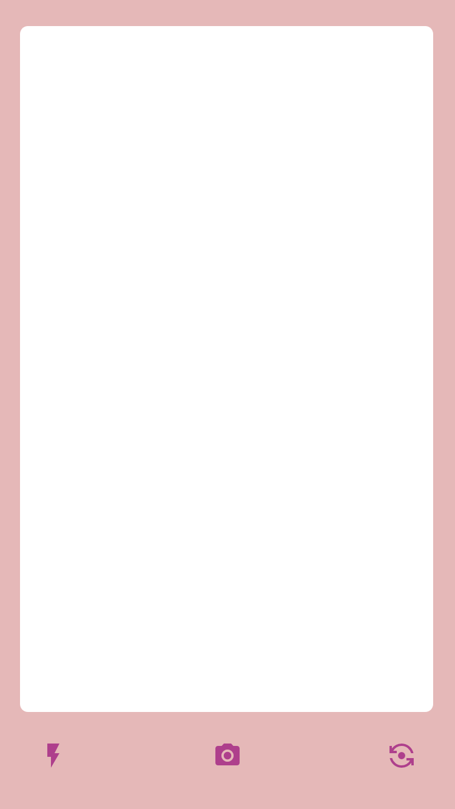
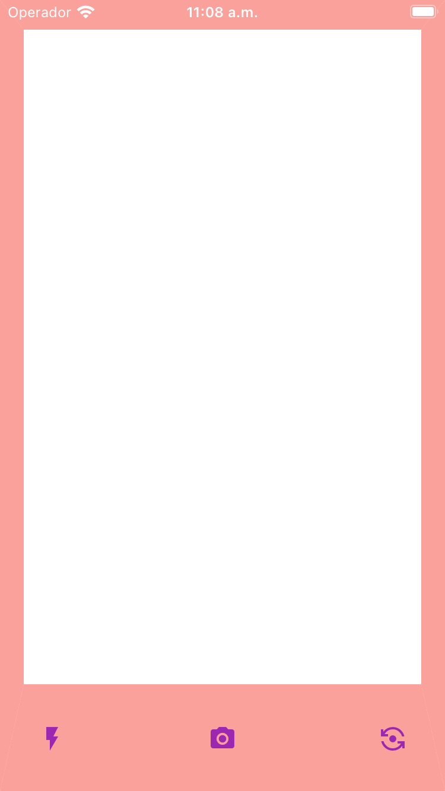
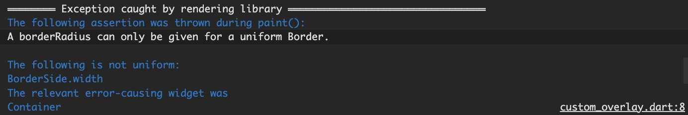
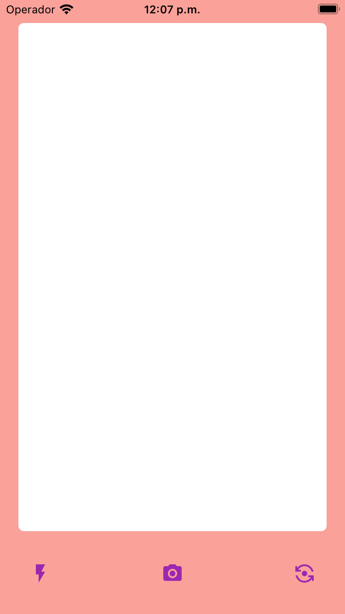


Just a small heads up: `Maybe a CustomPainter would be a better/easier solution, though` :wink:.<br>
I allways thought that creating a custom border shape in Flutter was a simple task, but I was wrong. I want to share with you the solution I found to achieve it.


**Important note:** I found this solution some time ago, and I'm not able to find the source of it. If you know the original author, please let me know so I can give him/her the credits!! :smile:.

## Why can't we just use the border+borderradius properties? :thinking:

This is the design my team wanted to achieve:<br>
_(This is just **oversimplified** version of it, but it's enough to understand the problem)_



Ok, this is not a super complex design, but I thought that it would be a simple task to achieve it. I mean, we just need to create a custom border shape, right?<br>
That was my first thought when I started to work on this. I wanted to create a custom border shape for a widget, so I thought that I could just use the [border](https://api.flutter.dev/flutter/painting/BoxDecoration/border.html) and [borderRadius](https://api.flutter.dev/flutter/painting/BoxDecoration/borderRadius.html) properties of the [BoxDecoration](https://api.flutter.dev/flutter/painting/BoxDecoration-class.html) class.


return Container(
decoration: BoxDecoration(
        border: Border(
          top: BorderSide(
            color: Colors.red.withOpacity(0.5),
            width: 25,
          ),
          bottom: BorderSide(
            color: Colors.red.withOpacity(0.5),
            width: 90,
          ),
          left: BorderSide(
            color: Colors.red.withOpacity(0.5),
            width: 20,
          ),
          right: BorderSide(
            color: Colors.red.withOpacity(0.5),
            width: 20,
          ),
        ),
      ),
    );


So... this is what I got:


Not bad, let's add some border radius to the container:

```dart
return Container(
// ...
  borderRadius: const BorderRadius.all(Radius.circular(6)),
// ...
);
```

Let's see the result
...<br>
`A borderRadius can only be given for a uniform Border.`<br>
... oh, no! :scream:




So it seems that we can't use the border and borderRadius properties to achieve this design. :disappointed:

## ColorFiltered at the rescue! :sunglasses:

After some research, I found a solution that worked for me. I used the [ColorFiltered](https://api.flutter.dev/flutter/widgets/ColorFiltered-class.html) widget to achieve it. <br>
This widget allows us to apply a color filter to its child. <br>
In this case, I used the [BlendMode.srcOut](https://api.flutter.dev/flutter/dart-ui/BlendMode.html) mode to achieve the desired effect, with a Stack as a child, this Stack will have a **DecoratedBox** with a backgroundBlendMode of [BlendMode.dstOut](https://api.flutter.dev/flutter/dart-ui/BlendMode.html) and a **Container** that will be the one that will determine the shape of the border.


    return ColorFiltered(
      colorFilter: ColorFilter.mode(
        Colors.red.withOpacity(0.5),
        BlendMode.srcOut,
      ),
      child: Stack(
        fit: StackFit.expand,
        children: [
          const DecoratedBox(
            decoration: BoxDecoration(
              color: Colors.black,
              backgroundBlendMode: BlendMode.dstOut,
            ),
          ),
          Container(
            margin: const EdgeInsets.only(
              top: 25,
              bottom: 90,
              left: 20,
              right: 20,
            ),
            decoration: const BoxDecoration(
              color: Colors.black,
              borderRadius: BorderRadius.all(Radius.circular(6)),
            ),
          ),
        ],
      ),
    );


And this is the result:



Pretty cool, right? :sunglasses:

## Conclusion :memo:

In this post, I showed you how to use the ColorFiltered widget to create a custom border shape in Flutter. <br>
Please, keep in mind that this is not the only way to achieve this! :wink:<br>

I hope you enjoyed it and that you found it useful.<br>
If you have any questions or suggestions, feel free to **leave a comment** below. :smile:<br>
Thanks for reading! :nerd_face:

The full **source code** for this post is available [here](https://github.com/cgutierr-zgz/custom_cutoff_overlay) :mag:<br>

## References :books:

- [ColorFiltered](https://api.flutter.dev/flutter/widgets/ColorFiltered-class.html)
- [BlendMode](https://api.flutter.dev/flutter/dart-ui/BlendMode.html)
- [BoxDecoration](https://api.flutter.dev/flutter/painting/BoxDecoration-class.html)
- [Border](https://api.flutter.dev/flutter/painting/Border-class.html)
- [BorderRadius](https://api.flutter.dev/flutter/painting/BorderRadius-class.html)
