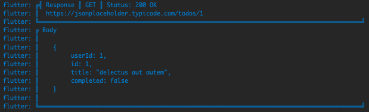
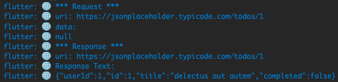

[dio](https://pub.dev/packages/dio) by [Flutterchina](https://flutterchina.club)


In this post, I'll show you how to use dio to make HTTP requests and how to use interceptors to refresh tokens and retry failed requests, everything while easily logging the requests and responses.

This post was made using:
- [dio version 4.0.6](https://pub.dev/packages/dio/versions/4.0.6)
- [dio_smart_retry version 1.3.2](https://pub.dev/packages/dio_smart_retry/versions/1.3.2)
- [pretty_dio_logger version 1.1.1](https://pub.dev/packages/pretty_dio_logger/versions/1.1.1)

## What is dio? :monocle_face:

Dio is a powerful Http client for Dart, which supports Interceptors, Global configuration, FormData, Request Cancellation, File downloading, Timeout etc.

Concepts we will be covering in this post:
1. Interceptors
Interceptors are a way to intercept and modify http requests before they are sent to the server and to intercept and modify http responses before they are returned to the caller.
2. Loggers
A logger is a way to log the requests and responses to the console.
3. Retries
A retry is a way to retry a failed request.
4. Token and Refresh Token
A token is a way to authenticate a user and a refresh token is a way to refresh that token when it expires.

## Setting up dio :wrench:

To use **dio**, you need to add it to your `pubspec.yaml` file:

```yaml
dependencies:
  dio: ^4.0.6
  dio_smart_retry: ^1.3.2 # optional
  pretty_dio_logger: ^1.1.1 # optional
```

The `dio_smart_try` and `pretty_dio_logger` packages are optional, but I'll be using them in this post, it's an **easy way to log the requests and responses** and to **retry failed requests**, but we will make our own retry interceptor for the refresh token part.<br>
I also make use of `flutter_appauth` and `flutter_secure_storage` in the example found in the repo.

## Making our custom dio client :rocket:

To make a request, you need to create a `Dio` instance and use the `get` method to make a `GET` request:

```dart
final dio = Dio();

final response = await dio.get<dynamic>(
  'https://jsonplaceholder.typicode.com/todos/1',
);


print(response.data);
```

Let's now create a custom `Dio` client that we can use in our app:

```dart
class DioClient extends DioForNative {
  DioClient({
    List<Interceptor>? interceptors,
    BaseOptions? options,
    int timeOutInMilliseconds = 30 * 1000,
  }) : super(
          options ??
              BaseOptions(
                connectTimeout: timeOutInMilliseconds,
                sendTimeout: timeOutInMilliseconds,
                receiveTimeout: timeOutInMilliseconds,
              ),
        );
}
```

Now we could simply use a new `DioClient` instance instence of the `Dio` in the example above.


## Interceptors :chains:

Let's now add some interceptors to our `DioClient`:

```dart
class DioClient extends DioForNative {
  DioClient(/*...*/) : super(/*...*/) {
    this.interceptors.addAll(
      [
        // Whatever interceptors you want to add from the constructor
        ...?interceptors,
      ],
    );
  }
}
```

That's just adding the interceptors passed in the constructor to the `interceptors` list of the `Dio` instance.
Let's now have a look at the interceptors we will be using in this post.

### Logger interceptor :scroll:

The `PrettyDioLogger` is a simple interceptor that logs the requests and responses to the console, if you don't want to use it you can make your own logger interceptor making use of the LogInterceptor class, here I'll show you how to add both, choose the one you prefer.

```dart
// ...
this.interceptors.addAll(
  [
    // ... previously added interceptors

    // Optionally add network Logger interceptor only for debug mode
    if (kDebugMode) ...[
	  // 1. PrettyDioLogger
      PrettyDioLogger(
        requestBody: true,
        responseBody: true,
        // ... other options
        requestHeader: false,
        responseHeader: false,
        error: false,
        request: false,
      ),

	  // 2. LogInterceptor
      LogInterceptor(
        requestBody: true,
        responseBody: true,
        // ... other options
        requestHeader: false,
        responseHeader: false,
        error: false,
        request: false,
        logPrint: (log) {
		  // Customice to your liking
          if (log.toString().isEmpty) return;
          debugPrint('🌐 ${log.toString()}');
        },
      ),
    ],
  ],
);
// ...
```

How does it look like in the console?

<b>PrettyDioLogger output:</b>



<b>LogInterceptor output:</b>


### Retry interceptor :repeat:

The `RetryInterceptor` is a simple interceptor that retries failed requests, there's not much to it, you can pass the number of retries you want to make and the `Dio` instance will retry the request that many times.

```dart
// ...
this.interceptors.addAll(
  [
    // ... previously added interceptors

	// RetryInterceptor -- has some more options, check the docs
    RetryInterceptor(dio: this, logPrint: print), 
  ],
);
// ...
```

### Token and Refresh Token interceptor :key:

I don't really know an out-of-the-box solution, so I'll be making my own interceptor to handle this.<br>
In the `AuthRepository` class we will be using the `flutter_appauth` package to authenticate the user and the `flutter_secure_storage` package to store the tokens, you can read more about the implementation in the [repo](https://github.com/cgutierr-zgz/dio-intercetors-loggers), take it as an example the repo does not have a complete implementation, it's just an example.<br>
The `AuthRepository` class will be used to authenticate the user and to refresh the token when it expires. To do so, we will add a new `InterceptorsWrapper` to the `DioClient` directly inside the `AuthRepository` class.<br>
This wrapper will have two main methods, the `onRequest` method will be called before the request is sent to the server, and the `onError` method will be called before the response is returned to the caller.

```dart

class AuthRepository {
  AuthRepository({
    required AuthProvider authProvider,
    required FlutterSecureStorage flutterSecureStorage,
  }) {
    _authProvider = authProvider;
    _secureStorage = flutterSecureStorage;

    final client = authProvider.client;
    client.interceptors.add(
      InterceptorsWrapper(
        onRequest: (request, handler) async {
        },
        onError: (e, handler) async {
        },
      ),
    );
  }

  late final AuthProvider _authProvider;
  late final FlutterSecureStorage _secureStorage;
  // ...

  // Implementation of the signIn, checkSession, refreshToken, signOut, deleteTokens, etc...
  // Please, refer to the repo for more info about the implementation
}
```

The `onRequest` method will be used to add the `Authorization` header to the request, and the `onError` method will be used to refresh the token when it expires.<br>
Let's now have a look at the implementation of the `onRequest` method:

```dart
// We add the accessToken to the headers if it's not null
final accessToken = await _secureStorage.read(key: _accessTokenKey);

if (accessToken != null) {
  request.headers['Authorization'] = 'Bearer $accessToken';
}
debugPrint('[DIO]: Added accessToken [${accessToken != null}]');

return handler.next(request);
```

Here we basically get the `accessToken` from the `FlutterSecureStorage` and add it to the request headers if it's not null, then we call the `handler.next(request)` method to continue with the request.<br>
Like this we do not have to add the `Authorization` header to every request we make, we just have to add the `DioClient` instance to the `AuthProvider` class and we are good to go :smile:.

---

Now let's have a look at the implementation of the `onError` method:

```dart
onError: (e, handler) async {
  // If the statuscode is 401 we try to refresh the token
  if (e.response?.statusCode == 401) {
    // We refresh the token
    await refreshTokens();
    // We add the accessToken to the headers if it's not null
    final accessToken = await _secureStorage.read(
      key: _accessTokenKey,
    );
    if (accessToken != null) {
      debugPrint('[DIO]: Refreshed Tokens');
      e.requestOptions.headers['Authorization'] = 'Bearer $accessToken';

      // Create request with new access token
      final opts = Options(
        method: e.requestOptions.method,
        headers: e.requestOptions.headers,
      );
      final cloneReq = await client.request<void>(
        e.requestOptions.path,
        options: opts,
        data: e.requestOptions.data,
        queryParameters: e.requestOptions.queryParameters,
      );

      return handler.resolve(cloneReq);
    }

    debugPrint("[DIO]: Couldn't refresh Tokens");
  }
},
```

Here we check if the status code of the response is 401, which, for our case, means that the token has expired, then we call the `refreshTokens` method to refresh the token, and we add the new `accessToken` to the request headers, then we create a new request with the new `accessToken` and we return the response to the caller.<br>

Voilà, we have a working interceptor that refreshes the token when it expires :tada:.

## Conclusion :memo:

In this post, I introduced you to the `Dio` package, I showed you how to use it to make HTTP requests, and I showed you how to use interceptors to add custom logic to the requests.<br>
Take this as an introduction to the `Dio` package, there's a lot more to it, you can check the [docs](https://pub.dev/packages/dio) for more info.<br>

I hope you enjoyed it and that you found it useful.<br>
If you have any questions or suggestions, feel free to **leave a comment** below. :smile:<br>
Thanks for reading! :nerd_face:

The full **source code** with for this post is available [here](https://github.com/cgutierr-zgz/dio-intercetors-loggers) :mag:<br>

The **pubspec.yaml** file for this project uses the following dependencies :package:

```yaml
dependencies:
  dio: ^4.0.6 # To make HTTP requests and to use the interceptors I created
  dio_smart_retry: ^1.3.2 # Easy way to add retry logic to the requests
  flutter:
    sdk: flutter
  flutter_appauth: ^4.2.1 # Used to authenticate the user and to refresh the token
  flutter_secure_storage: ^6.0.0 # Used to store the tokens in the secure storage
  pretty_dio_logger: ^1.1.1 # For logging the requests

dev_dependencies:
  flutter_test:
    sdk: flutter
  mocktail: ^0.3.0 # For mocking
  very_good_analysis: ^3.1.0 # Used to enforce very good practices 🦄
```

## References :books:

- [dio](https://pub.dev/packages/dio)
- [dio_smart_retry](https://pub.dev/packages/dio_smart_retry)
- [pretty_dio_logger](https://pub.dev/packages/pretty_dio_logger)
- [flutter_appauth](https://pub.dev/packages/flutter_appauth)
- [flutter_secure_storage](https://pub.dev/packages/flutter_secure_storage)