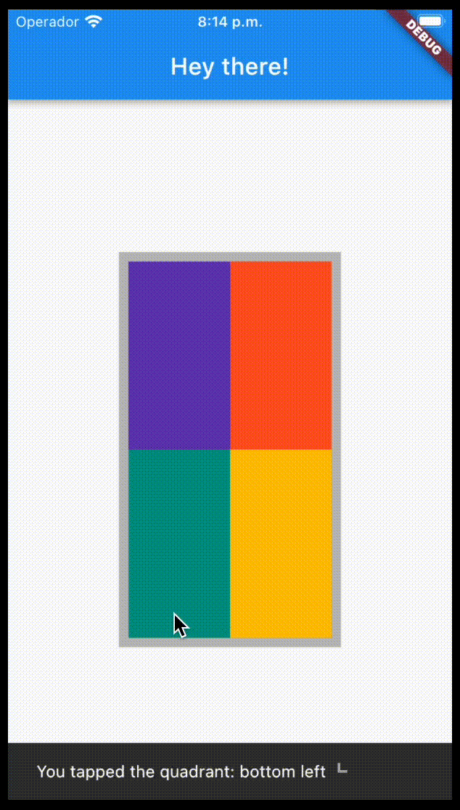
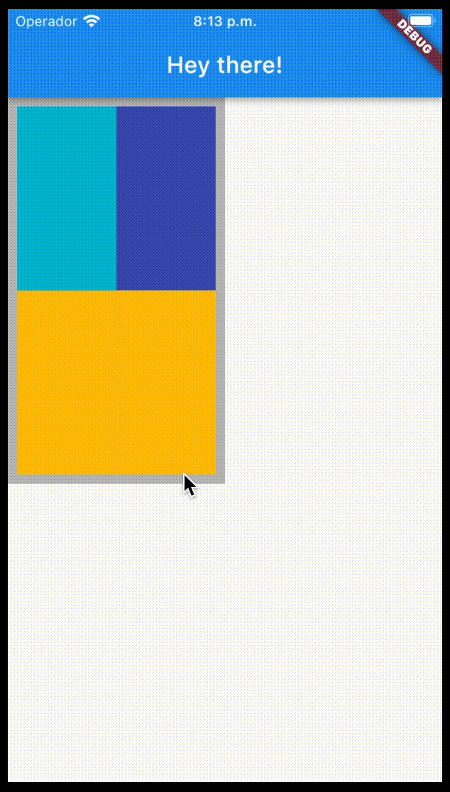
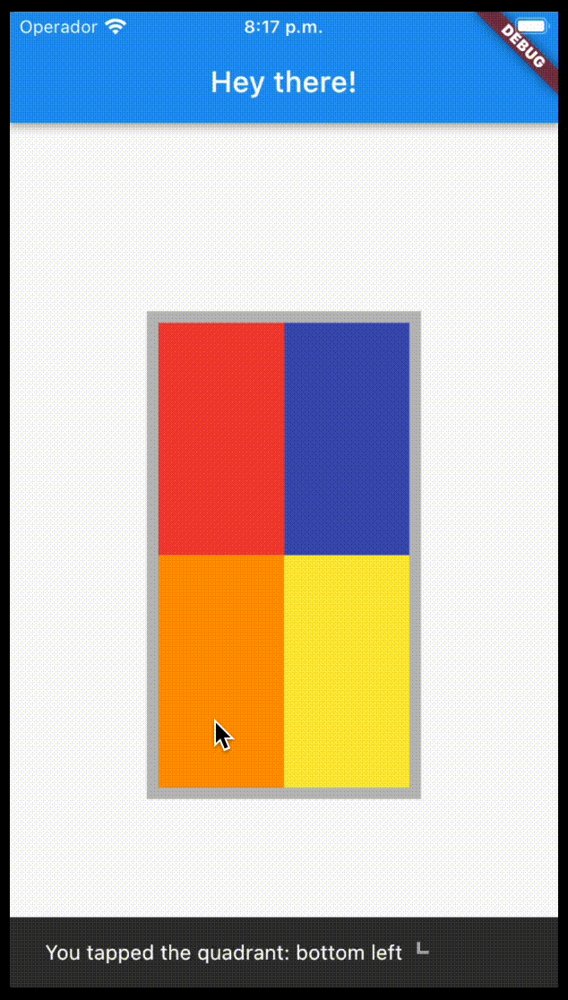


I've recently had an usecase that I never had before: I needed to -based on a given widget- retrieve the relative position of a click on that widget and make an action based on that position.
 
It might be a super simple usecase, but I never had to do it before, so I found it interesting to share it with you! :smile:


## Maybe current context's size is enough? :thinking:

I started by using the current context's size to calculate the position of the click


@override
Widget build(BuildContext context) {
  final size = MediaQuery.of(context).size;
  return GestureDetector(
    onTapDown: (details) {
      if (details.globalPosition.dx < size.width / 2) {
        // left side
        if (details.globalPosition.dy < size.height / 2) {
          // top left
        } else {
          // bottom left
        }
      } else {
        // right side
        if (details.globalPosition.dy < size.height / 2) {
          // top right
        } else {
          // bottom right
        }
      }
    },
  );
}
// ...


Ok, this works... for a widget that takes the whole screen.

But what if we want to use this on a widget that is not taking the whole screen?

We would need to calculate the position of the widget on the screen and then calculate the relative position of the click on that widget.

## Let's use the RenderBox :rocket:

The [RenderBox](https://api.flutter.dev/flutter/rendering/RenderBox-class.html) class is a base class for render objects that have a visual representation. It provides a basic set of layout and painting functionality, and the [RenderBox.size](https://api.flutter.dev/flutter/rendering/RenderBox/size.html) property is the size of the box.

So, we can use the [RenderBox.localToGlobal](https://api.flutter.dev/flutter/rendering/RenderBox/localToGlobal.html) method to get the position of the widget on the screen and then calculate the relative position of the click on that widget.


@override
Widget build(BuildContext context) {
  return GestureDetector(
	onTapDown: (details) {
	  final renderBox = context.findRenderObject() as RenderBox;
	  final position = renderBox.localToGlobal(Offset.zero);
	  if (details.globalPosition.dx < position.dx + renderBox.size.width / 2) {
		// left side
		if (details.globalPosition.dy < position.dy + renderBox.size.height / 2) {
		  // top left
		} else {
		  // bottom left
		}
	  } else {
		// right side
		if (details.globalPosition.dy < position.dy + renderBox.size.height / 2) {
		  // top right
		} else {
		  // bottom right
		}
	  }
	},
  );
}


Whoa! That's a lot of code for something that should be simple :sweat_smile:  
I did not manage to find a simpler way to do this, but if you know one, please let me know in the comments :wink:

## Conclusion :memo:

In this post, I showed you how to get the relative position of a click on a widget using the [RenderBox](https://api.flutter.dev/flutter/rendering/RenderBox-class.html) class.  
Might be useful for you if you need to do something like this in your app :smile:

I hope you enjoyed it and that you found it useful. 
If you have any questions or suggestions, feel free to **leave a comment** below. :smile: 
Thanks for reading! :nerd_face:

The full **source code** for this post is available [here](https://github.com/cgutierr-zgz/position_relative_to_widget) :mag: 

## References :books:

- [RenderBox](https://api.flutter.dev/flutter/rendering/RenderBox-class.html)
- [RenderBox.size](https://api.flutter.dev/flutter/rendering/RenderBox/size.html)
- [RenderBox.localToGlobal](https://api.flutter.dev/flutter/rendering/RenderBox/localToGlobal.html)